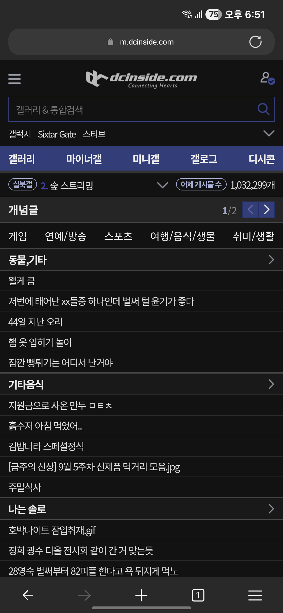
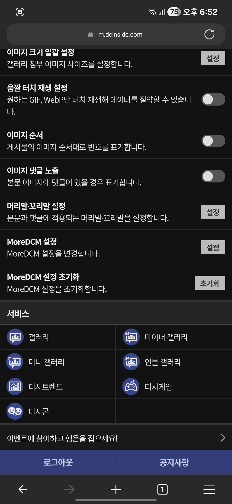
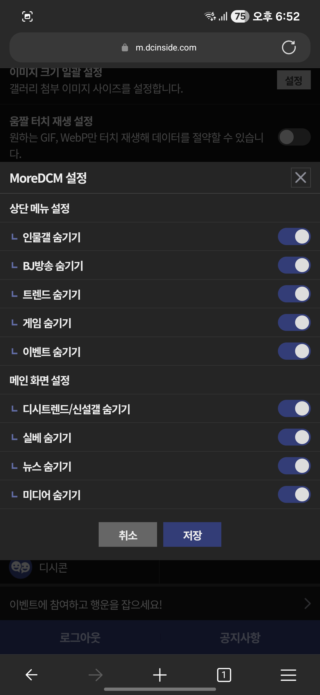

# MoreDCM
디시인사이드 모바일 웹을 향상시켜주는 유저스크립트입니다.





## 기능
* 브라우저의 다크 모드가 활성화되어 있으면 자동으로 야간 모드 활성화
* 불필요한 상단 메뉴 항목 숨기기(트렌드, 이벤트 등...)
* 불필요한 메인 화면 항목 숨기기(실베 등...)
* 향후에 더 많은 기능을 추가할 예정입니다.

## 설치 방법
1. [Tampermonkey](https://www.tampermonkey.net/)를 설치하세요. (확장을 미지원하는 모바일 크롬에서는 사용 불가)
2. 다음 링크에 접속하세요: https://github.com/na1307/moredcm/raw/refs/heads/publish/moredcm.user.js

## 개발 방법
1. [Node.js](https://nodejs.org/) 24를 설치하세요. [fnm](https://github.com/Schniz/fnm)을 이용하여 설치하는 것을 권장합니다.
2. [Corepack](https://github.com/nodejs/corepack)을 활성화하세요.
  ```bash
  corepack enable
  ```
3. 다음 명령을 입력해서 빌드하세요.
  ```bash
  pnpm install
  pnpm build
  ```

## LICENSE
MIT
